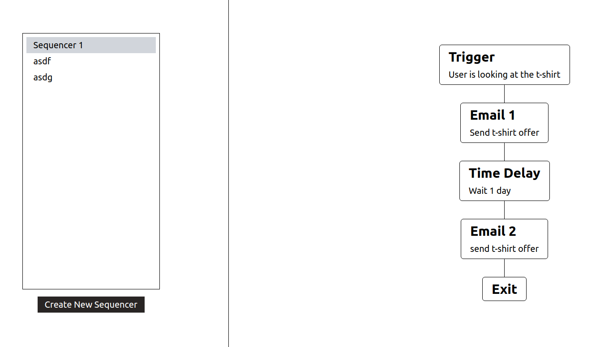
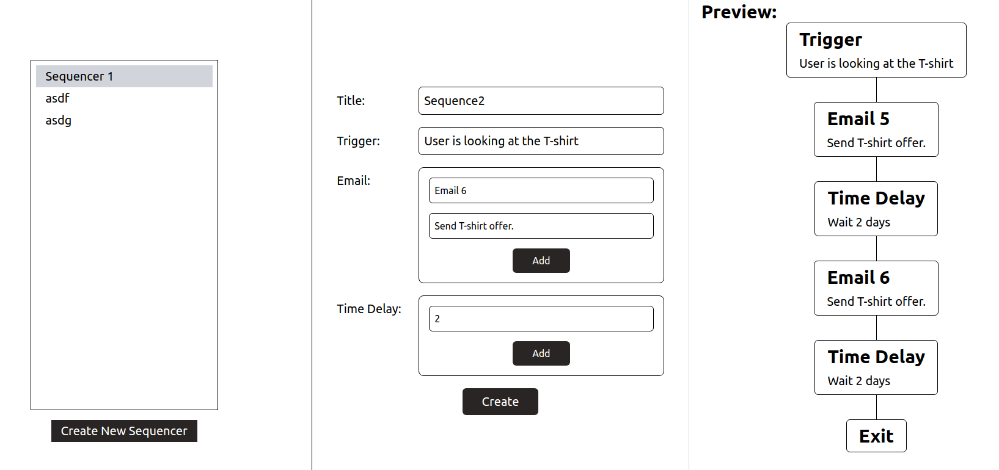

# digital-campaign-sequencer
This is a simple Ruby on Raills application to design digital-campaign-sequencer.

[Database Recording](https://www.loom.com/share/64da6f81349145f6aa97ef90a60ae0ca)




## Task
- Be able to create a sequence.
- Be able to create/use the Email block (send an email).
- Be able to create a Time Delay Block

## Challenge
Demonstrate the applicant's problem-solving and programming capabilities.

## Tech stacks
- Ruby on Rails
- React
- Typescript
- Tailwind CSS

## Development Environment
- Ubuntu 22.04
- Ruby 3.1.0
- Rails 7.1.3.2
- Node 20.10.0
- Npm 10.2.3

## Steps to run backend
1. Migreate database
   ```shell
   rails db:migrate
   ```

2. Run backend
   ```shell
   rails server
   ```

This will run backend server on http://localhost:5000.

## Steps to run frontend
1. Install node modules
   ```shell
   npm install
   ```

2. Add .env file
   ```
   VITE_API_URL=/api
   ```

3. Run frontend
   ```shell
   npm run dev
   ```

This will run frontend on http://localhost:5173.